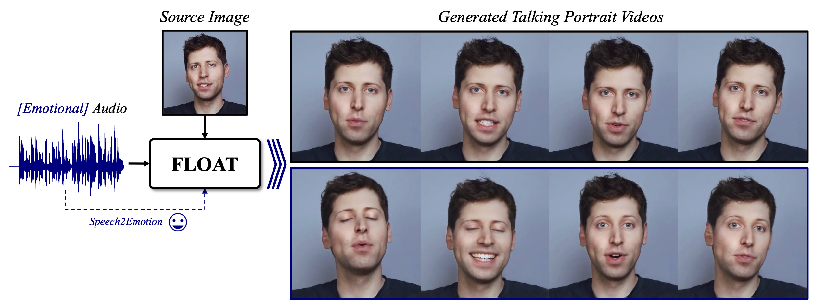

# FLOAT: Generative Motion Latent Flow Matching for Audio-driven Talking Portrait
Official Pytorch Implementation of FLOAT; Flow Matching for Audio-driven Talking Portrait Video Generation



**FLOAT: Generative Motion Latent Flow Matching for Audio-driven Talking Portrait**<br>
[Taekyung Ki](https://taekyungki.github.io), [Dongchan Min](https://kevinmin95.github.io), [Gyeongsu Chae](https://www.aistudios.com/ko)

Project Page: https://deepbrainai-research.github.io/float/

**Abstract**: *With the rapid advancement of diffusion-based generative models, portrait image animation has achieved remarkable results. However, it still faces challenges in temporally consistent video generation and fast sampling due to its iterative sampling nature. This paper presents FLOAT, an audio-driven talking portrait video generation method based on flow matching generative model. We shift the generative modeling from the pixel-based latent space to a learned motion latent space, enabling efficient design of temporally consistent motion. To achieve this, we introduce a transformer-based vector field predictor with a simple yet effective frame-wise conditioning mechanism. Additionally, our method supports speech-driven emotion enhancement, enabling a natural incorporation of expressive motions. Extensive experiments demonstrate that our method outperforms state-of-the-art audio-driven talking portrait methods in terms of visual quality, motion fidelity, and efficiency.*

**TL:DR: FLOAT is a flow matching based audio-driven talking portrait video generation method, which can enhance the speech-driven emotional motion.**

<br>

## Generation Results

| Result 1 | Result 2 |
|---------------|---------|
| <video src="https://github.com/user-attachments/assets/8c00274d-795d-4ee9-870f-84a859f3e23f"> </video> | <video src="https://github.com/user-attachments/assets/c6e142b3-519b-4cda-b26d-e088414b478d"> </video> |

| Result 3 | Result 4 |
|--------|-----------|
| <video src="https://github.com/user-attachments/assets/7b201a5f-a293-46cd-974f-0612062d8d94"> </video> |  <video src="https://github.com/user-attachments/assets/dd4b74dd-40b4-4864-b87d-7cbf4f0d66da"> </video> |


## Updates
- [2025.02.17] The inference code and checkpoints are released under a **[Non-commercial License](https://creativecommons.org/licenses/by-nc-nd/4.0/)**.
- [2024.12.03] Selected as a [HuggingFace Daily Papers](https://huggingface.co/papers?date=2024-12-03) on December 3, 2024. 
- [2024.12.02] The paper is publicly available on [ArXiv](https://arxiv.org/abs/2412.01064).


## Getting Started
### Requirements
```.bash
# 1. Create Conda Environment
conda create -n FLOAT python=3.8.5
conda activate FLOAT

# 2. Install torch and requirements
sh environments.sh

# or manual installation
pip install torch==2.0.1 torchvision==0.15.2 torchaudio==2.0.2 --index-url https://download.pytorch.org/whl/cu118
pip install -r requirements.txt
```
- Test on Linux, A100 GPU, and V100 GPU.

### Preparing checkpoints

1. Download checkpints automatically

    ```.bash
    sh download_checkpoints.sh
    ```

    or download checkpoints manually from this [google-drive](https://drive.google.com/file/d/1rvWuM12cyvNvBQNCLmG4Fr2L1rpjQBF0/view?usp=sharing).

2. The checkpoints should be organized as follows:
    ```.bash
    ./checkpints
    |-- checkpoints_here
    |-- float.pth                                       # main model
    |-- wav2vec2-base-960h/                             # audio encoder
    |   |-- .gitattributes
    |   |-- config.json
    |   |-- feature_extractor_config.json
    |   |-- model.safetensors
    |   |-- preprocessor_config.json
    |   |-- pytorch_model.bin
    |   |-- README.md
    |   |-- special_tokens_map.json
    |   |-- tf_model.h5
    |   |-- tokenizer_config.json
    |   '-- vocab.json
    '-- wav2vec-english-speech-emotion-recognition/     # emotion encoder
        |-- .gitattributes
        |-- config.json
        |-- preprocessor_config.json
        |-- pytorch_model.bin
        |-- README.md
        '-- training_args.bin
    ```
   - W2V based models could be found in the links: [wav2vec2-base-960h](https://huggingface.co/facebook/wav2vec2-base-960h) and [wav2vec-english-speech-emotion-recognition](https://huggingface.co/r-f/wav2vec-english-speech-emotion-recognition).


### Generating Talking Portait Video from Single Image and Audio
1. Pre-process;❗ **Important** ❗ for better quality. Please read this.
- FLOAT is trained on the frontal head pose distributions. Non-frontal image may lead to suboptimal results.
- The performance of taking portrait methods often depends on their training preprocess strategies, e.g., the field-of-view. The inference code includes an automatic face-cropping function, which may involve black **padding** regions. You can manually disable the cropping process in `generate.py`, however it may lead to suboptimal performance.
- If your audio contains heavy background music, please use [ClearVoice](https://github.com/modelscope/ClearerVoice-Studio) to extract the vocals for better performance.


1. Generating video 1 (Emotion from Audio)
   
    You can generate a video with an emotion from audio without specifying `--emo`. You can adjust the intensity of the emotion using `--e_cfg_scale` (default 1). For more emotion intensive video, try large value from 5 to 10 for `--e_cfg_scale`. 
    ```.bash
    CUDA_VISIBLE_DEVICES=0 python generate.py
        --ref_path path/to/reference/image \
        --aud_path path/to/audio \
        --seed 15 \
        --a_cfg_scale 2 \
        --e_cfg_scale 1 \
        --ckpt_path ./checkpoints/float.pth
        --no_crop                    # [optional] skip cropping
    ```

2. Generate video 2 (Redirecting Emotion)
    You can generate a video of other emotion by specifying `--emo`. It supports seven basic emotions: ['angry', 'disgust', 'fear', 'happy', 'neutral', 'sad', 'surprise']. You can adjust the intensity of the emotion using `--e_cfg_scale` (default 1). For more emotion intensive video, try large value from 5 to 10 for `--e_cfg_scale`.
    ```.bash
    CUDA_VISIBLE_DEVICES=0 python generate.py\
        --ref_path path/to/reference/image \ 
        --aud_path path/to/audio \
        --emo 'happy' \             # Seven emotions ['angry', 'disgust', 'fear', 'happy', 'neutral', 'sad', 'surprise'] 
        --seed  15 \ 
        --a_cfg_scale 2 \
        --e_cfg_scale 1 \
        --ckpt_path ./checkpoints/float.pth \
        --no_crop                   # [optional] skip cropping
    ```

    <video src="https://github.com/user-attachments/assets/fb3826cd-231b-46f2-809b-11adebe9a1cf"> </video> 

    <br>

3. Running example and results
    ```.bash
    CUDA_VISIBLE_DEVICES=0 python generate.py \
        --ref_path assets/sam_altman.webp \ 
        --aud_path assets/aud-sample-vs-1.wav \
        --seed  15 \ 
        --a_cfg_scale 2 \
        --e_cfg_scale 1 \
        --ckpt_path ./checkpoints/float.pth
    ```
    

    | Before Crop | After Crop | Result |
    |---------------|---------|--------|
    |  |  | <video src='https://github.com/user-attachments/assets/3353e4e0-00f5-429b-bc66-5db9a72186b8'> </video> |

<br>

## ❗License❗
This work is licensed under a [Creative Commons Attribution-NonCommercial-NoDerivatives 4.0 International License](https://creativecommons.org/licenses/by-nc-nd/4.0/). You may not use this work for commercial purposes and may use it only for research purposes. **For any commercial inquiries or collaboration opportunities**, please contact daniel@deepbrain.io.


## Development
This repository is a research demonstration implementation and is provided as a one-time code drop. For any research-related inquiries, please contact the first author [Taekyung Ki](https://github.com/TaekyungKi). This work was done during the first author's South Korean Alternative Military Service at DeepBrain AI. This repository includes only the inference code; the training code will not be released. 

## Citation
```bibtex
@article{ki2024float,
  title={FLOAT: Generative Motion Latent Flow Matching for Audio-driven Talking Portrait},
  author={Ki, Taekyung and Min, Dongchan and Chae, Gyeongsu},
  journal={arXiv preprint arXiv:2412.01064},
  year={2024}
}
```

## Related Works
- [StyleLipSync: Style-based Personalized Lip-sync Video Generation](https://arxiv.org/abs/2305.00521)<br>
- [StyleTalker: One-shot Style-based Audo-driven Talking Head Video Generation](https://arxiv.org/abs/2208.10922)<br>
- [Export3D: Learning to Generate Conditional Tri-plane for 3D-aware Expression Controllable Portrait Animation](https://arxiv.org/abs/2404.00636)<br>

## Acknowledgements

The source images and audio are collected from the internet and other baselines, such as SadTalker, EMO, VASA-1, Hallo, LivePortrait, Loopy, and others. We appreciate their valuable contributions to this field. We employ Wav2Vec2.0-based speech emotion recognizer by [Rob Field](https://huggingface.co/r-f/wav2vec-english-speech-emotion-recognition). We appreciate this good work.
